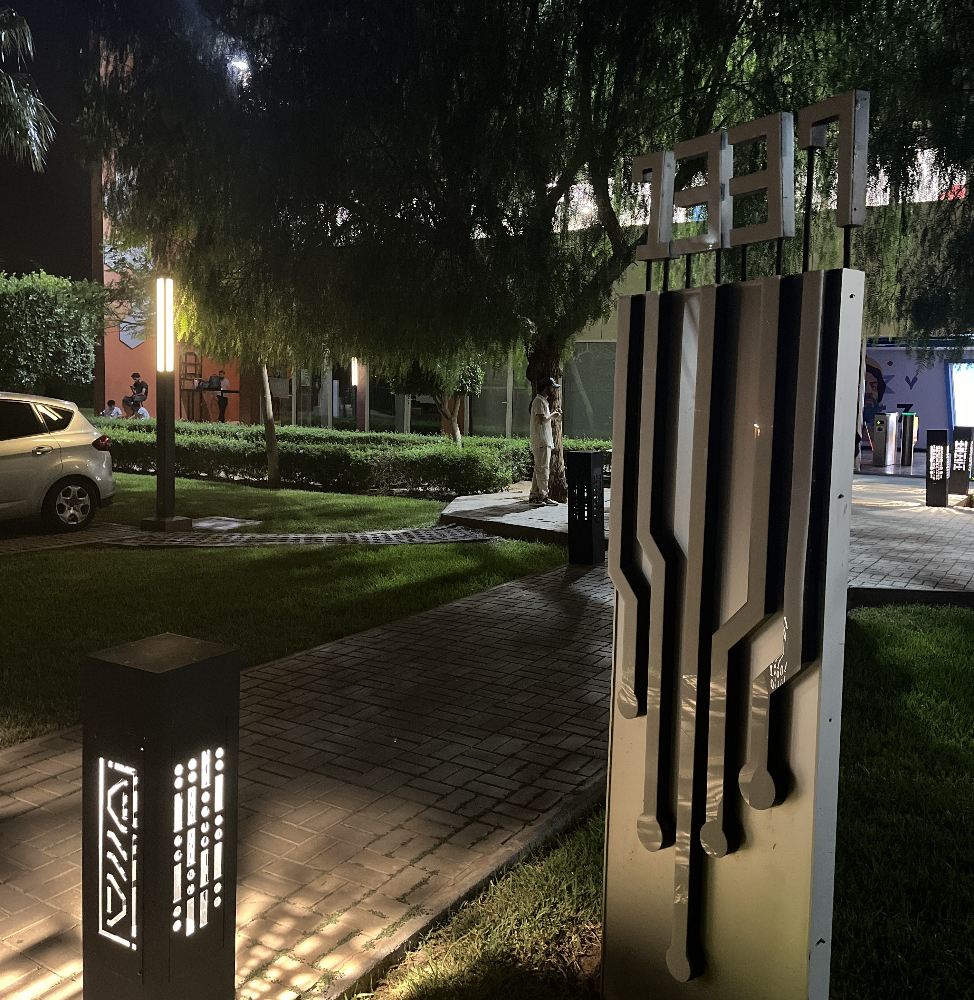

# 1337 Bengrir 
<h2>Welcome to the 1337 Bengrir! This repository is dedicated to sharing the Pool/picine experience.</h2>

## Introduction / Rules : 

42 is a pioneering computer programming school that offers free education to students aged 18 and above, regardless of educational background. At 42, learning is driven by peer interaction rather than traditional lectures or teachers.

> There are three 42 campuses in Morocco aka 1337 *bengurir is the best ;)*

## Days : 
[Shell00](shell00) 
[Shell01](Shell01) 
[C00](C00) 
[C01](C01) 
[C02](C02) 
[Rush00](rush00) 
[C03](C03) 
[C04](C04) 
[C05](C05) 
[C06](C06) 
[C07](C07) 
[C08](C08) 
> rush00 is a must-do
 
## Exam 
[Exam Prep](Exam Prep) 

## Images && Socials 
> need permission :))

## Side Note 

During my time here, I've had the pleasure of meeting awesome poolers and students. It's been a unique experience, though I've encountered a few interesting characters along the way. Overall, the Pool offers a 30-day intense, hands-on, low-level learning experience that every developer should undertake.

